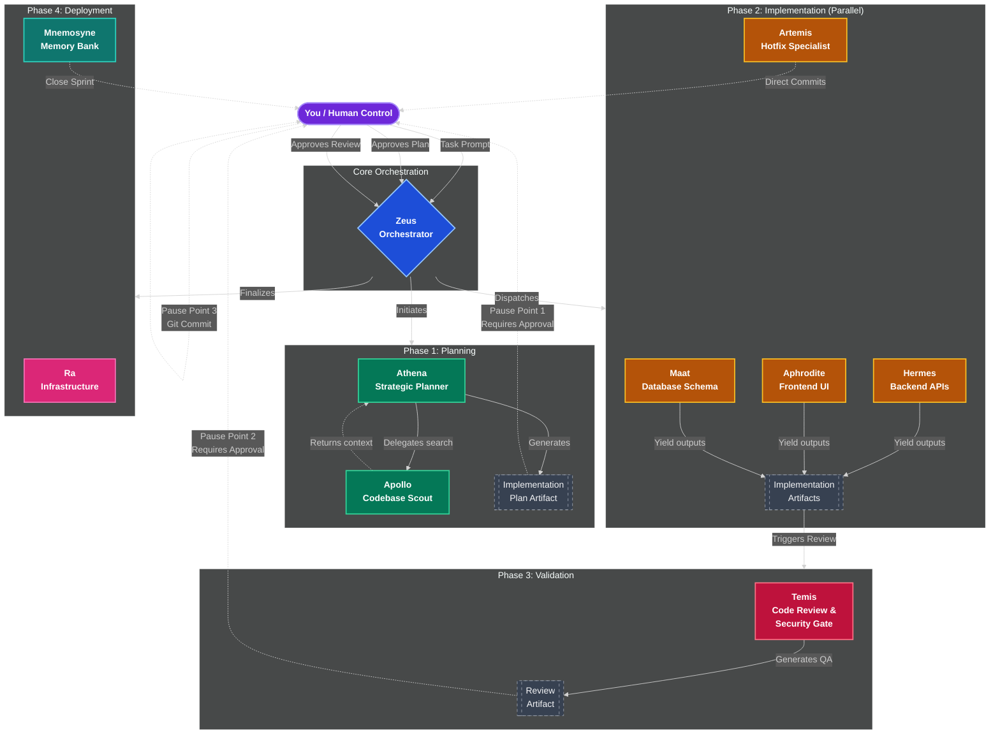

# mythic-agents

**A multi-agent orchestration framework for GitHub Copilot that coordinates 10 specialized AI agents to implement production-ready features with enforced TDD, continuous code review, and persistent project memory.**

---

## Table of Contents

- [Overview](#overview)
- [How It Works](#how-it-works)
- [The 10 Agents](#the-10-agents)
- [Workflow](#workflow)
- [Artifact System](#artifact-system)
- [Memory System](#memory-system)
- [Quick Start](#quick-start)
- [Repository Structure](#repository-structure)
- [Advanced Usage](#advanced-usage)
- [Security & Privacy](#security--privacy)
- [Contributing](#contributing)
- [FAQ](#faq)

---

## Overview

Traditional single-agent coding produces mediocre results because one agent attempts to plan, implement, test, review, and document simultaneously. The result is context fragmentation, skipped tests, and generic code.

mythic-agents solves this with **specialization**: each agent is an expert at exactly one thing and is invoked only when that expertise is needed.

| Metric | Single Agent | mythic-agents |
|---|---|---|
| Implementation time | 8–10 hours | 6–8 hours |
| Average test coverage | 65–75% | 92% |
| Code review cadence | End of feature | After every phase |
| Bugs reaching production | 3–5 per feature | 0 (TDD enforced) |
| Documentation | Manual | Auto-generated |

---

## How It Works

The system operates in three phases controlled by **you**. Agents work in parallel within each phase. You approve before anything proceeds.



### Three Core Principles

**1. Specialization**

Each agent has a focused, narrow context. Hermes knows FastAPI async patterns and nothing about React. Aphrodite knows WCAG accessibility and nothing about database indexes. This produces better code than a generalist at every layer.

**2. Test-Driven Development — enforced**

No phase proceeds without minimum 80% test coverage. The RED → GREEN → REFACTOR cycle is not optional:

```
RED      Write a failing test. The requirement is now defined in code.
GREEN    Write the minimum implementation to make it pass.
REFACTOR Improve the code without breaking the test.
```

**3. You stay in control — via artifacts**

Every phase produces a structured **artifact** (a file in `docs/memory-bank/.tmp/`) before anything proceeds. You read the artifact, approve or request changes, then the next phase begins. There are three explicit pause points where the system stops and waits for your approval. AI does the work; you make every architectural and commit decision.

---

## The 10 Agents

| Agent | Role | Invoked when |
|---|---|---|
| **Zeus** | Orchestrator | Features spanning multiple layers — coordinates all other agents |
| **Athena** | Strategic planner | Any complex new feature — produces phased implementation plan |
| **Apollo** | Codebase scout | Pattern discovery, existing code analysis, parallel search |
| **Hermes** | Backend specialist | APIs, services, business logic — FastAPI, async/await, TDD |
| **Aphrodite** | Frontend specialist | UI components, React, TypeScript, WCAG accessibility |
| **Maat** | Database specialist | Schema design, query optimization, zero-downtime migrations |
| **Temis** | Code reviewer | Auto-invoked after each phase — enforces coverage, OWASP, performance |
| **Ra** | Infrastructure | Docker, CI/CD, zero-downtime deployments, Traefik |
| **Artemis** | Hotfix specialist | Rapid bug fixes, CSS tweaks, typos — bypasses orchestration |
| **Mnemosyne** | Memory owner | Sprint close, ADR recording, task documentation |

Each agent is defined in its own `.agent.md` file with a specific model assignment, tool set, and behavioral rules. See [AGENTS.md](AGENTS.md) for the full reference.

---

## Workflow

### Full orchestration (recommended for complex features)

```
@zeus: Implement email verification with rate limiting and 24-hour token expiry
```

Zeus plans with Athena, discovers context with Apollo, then coordinates Maat → Hermes → Aphrodite in parallel, with Temis reviewing after each phase.

### Direct invocation (for focused tasks)

```
# Backend only
@hermes: Create POST /products endpoint with cursor-based pagination

# Frontend only
@aphrodite: Refactor ProductCard for accessibility — target WCAG AA

# Database only
@maat: Optimize orders table — detect and fix N+1 queries

# Review only
@temis: Review this PR for security vulnerabilities

# Discovery only
@apollo: Find all usages of the deprecated getUserById method

# Memory update
@mnemosyne: Close sprint — documented JWT auth implementation
```

### Real-world example: email verification feature

**Request:**
```
@athena: Plan email verification flow — registration sends email, link expires 24h, frontend shows form, rate limit 5/min
```

**Phase 1 — Planning** (Athena):
- Produces **`PLAN-email-verification.md`** in `docs/memory-bank/.tmp/`
- ⏸️ You read the plan, approve or request changes

**Phase 2 — Implementation (parallel)** (Hermes + Aphrodite + Maat simultaneously):
- Hermes: `IMPL-phase2-hermes.md` — APIs, services, 12 tests
- Aphrodite: `IMPL-phase2-aphrodite.md` — `VerificationForm` component, 8 tests
- Maat: `IMPL-phase2-maat.md` — migration, indexes, rollback verified

**Phase 3 — Quality gate** (Temis):
- Produces **`REVIEW-email-verification.md`** — verdict + "Human Review Focus" items
- ⏸️ You read the review, validate the items only you can judge

**Sprint close** (Mnemosyne):
- `docs/memory-bank/.tmp/` wiped (all ephemeral artifacts deleted)
- `04-active-context.md` updated with sprint summary
- ⏸️ You execute `git commit`

---


### 🔄 Native VS Code Handoff Integration

**mythic-agents** is built to take full advantage of the [VS Code Copilot native Agent Handoff feature](https://code.visualstudio.com/docs/copilot/agents/overview#_hand-off-a-session-to-another-agent) out of the box!

Instead of mixing all contexts into a single messy chat window, you can seamlessly **hand off** your current context and history to a specialized agent using the UI or the `/delegate` command.

1. **Context Isolation**: When Zeus delegates to Athena (or you click the suggested handoff button), VS Code opens a **brand new chat session** specifically for Athena.
2. **Context Injection**: The *entire chat history* from your conversation with Zeus is automatically carried over to Athena so she doesn't lose track of the plan.
3. **Pristine History**: The original Zeus orchestrator session is archived smoothly, keeping your active chat extremely focused and token-efficient.

All agents have their `handoffs:` pre-configured in their YAML definitions to prompt UI buttons within Copilot chat automatically!

---

## Artifact System

Every phase produces a **structured artifact** — a temporary file written to `docs/memory-bank/.tmp/` that summarizes what was done and what you need to review before the next phase begins.

| Artifact | Produced by | Consumed by | What it contains |
|---|---|---|---|
| `PLAN-<feature>.md` | Athena | You, Zeus | Phases, risks, open questions for your judgment |
| `IMPL-<phase>-<agent>.md` | Hermes / Aphrodite / Maat | Temis | What was built, test results, notes for reviewer |
| `REVIEW-<feature>.md` | Temis | You | Verdict, issues found, **Human Review Focus** |
| `DISC-<topic>.md` | Apollo (subagent) | Athena, Zeus | Discovery findings from isolated research |
| `ADR-<topic>.md` | Any agent | All | Architectural decisions — **permanent, committed** |

### Key properties

- **`docs/memory-bank/.tmp/`** is gitignored — artifacts never enter the git history
- On `@mnemosyne Close sprint`, the entire `.tmp/` folder is wiped automatically
- **ADR artifacts** (architectural decisions) go to `docs/memory-bank/_notes/` and are never deleted
- You can inspect the tmp folder at any time — it's a plain directory of markdown files

### Cleanup commands

```
@mnemosyne Close sprint: [summary]    ← wipes .tmp/ + closes sprint
@mnemosyne Clean tmp                  ← wipes .tmp/ without closing sprint
@mnemosyne List artifacts             ← shows what's in .tmp/
```

### Human Review Focus

Every `REVIEW-` artifact includes a **Human Review Focus** section — 1–2 specific items that require your judgment and cannot be fully validated by AI (e.g., business logic correctness, UX decisions, security edge cases specific to your domain).

---

## Memory System

mythic-agents uses two complementary memory layers:

```mermaid
%%{init: {'theme': 'dark'}}%%
flowchart LR
    classDef default fill:#2d2d2d,stroke:#555,stroke-width:1px,color:#eee,rx:5px,ry:5px;
    classDef level1 fill:#1e3a5f,stroke:#2a5082,stroke-width:2px,color:#fff;
    classDef level2 fill:#4b2743,stroke:#6e3962,stroke-width:2px,color:#fff;

    subgraph L1["⚡ Level 1 — Native (auto-loaded)"]
        direction TB
        MR["/memories/repo/<br/>Atomic facts: stack, commands,<br/>conventions — always in context"]:::level1
        MS["/memories/session/<br/>Conversation plans, WIP<br/>Discarded on session end"]:::level1
    end

    subgraph L2["📚 Level 2 — Narrative (explicit read)"]
        MB["docs/memory-bank/<br/>00 — Project overview<br/>01 — Architecture<br/>02 — Components<br/>03 — Tech context<br/>04 — Active context  ← priority<br/>05 — Progress log<br/>.tmp/ — ephemeral artifacts (gitignored)<br/>_notes/ — decision records (ADRs, committed)"]:::level2
    end

    L1 -. "graduates to at sprint close" .-> L2
    
    style L1 fill:#1e1e1e,stroke:#333,stroke-width:2px,rx:10px
    style L2 fill:#1e1e1e,stroke:#333,stroke-width:2px,rx:10px
```



**`04-active-context.md`** is the priority file. Agents read it first when starting any task. It contains the current sprint focus, the most recent architectural decision, active blockers, and next steps.

**Level 1** is loaded automatically — no agent action required. **Level 2** is read explicitly when starting a new feature or joining an ongoing sprint.

### Copilot Instructions bridge

`.github/copilot-instructions.md` is auto-read by Copilot on every VSCode session. It points Copilot to `04-active-context.md` and `00-overview.md` and defines global coding standards for your product.

When adopting mythic-agents in a product repo, customize this file with your stack and standards.

---

## Quick Start

### Prerequisites

- VSCode 1.87+ with GitHub Copilot Chat 0.20+
- GitHub Copilot subscription (Pro, Pro+, Business, or Enterprise)
- Git basics (`clone`, `commit`, `push`)

### Supported stacks

Backend: Python/FastAPI, Python/Django, Node.js/Express  
Frontend: React/TypeScript, Next.js  
Database: PostgreSQL, MySQL  
Infra: Docker, Traefik, GitHub Actions

### Installation

```bash
# 1. Clone into your project (or copy the framework folders)
git clone https://github.com/your-org/copilot-agents
cp -r copilot-agents/agents copilot-agents/instructions \
      copilot-agents/prompts copilot-agents/skills \
      copilot-agents/.github copilot-agents/docs \
      /path/to/your-product/

# 2. Customize the Copilot instructions for your product
# Edit .github/copilot-instructions.md — set your stack, standards, and coding patterns

# 3. Initialize your memory bank
# Fill docs/memory-bank/00-overview.md through 03-tech-context.md (do this once)
# Keep docs/memory-bank/04-active-context.md updated at every sprint
```

### Your first feature

```
# 1. Plan
@athena: Plan JWT authentication with refresh tokens
```

Athena produces `docs/memory-bank/.tmp/PLAN-jwt-auth.md`.

```
# 2. Read the plan artifact, then approve
# Open docs/memory-bank/.tmp/PLAN-jwt-auth.md
# Reply: "Approved, proceed"

# 3. Implement
@zeus: Implement JWT auth using the approved plan
```

Zeus coordinates parallel execution (Maat + Hermes + Aphrodite). Each worker produces an `IMPL-` artifact. Temis reviews and produces `REVIEW-jwt-auth.md`.

```
# 4. Read the review artifact, validate Human Review Focus items, then commit
# Open docs/memory-bank/.tmp/REVIEW-jwt-auth.md
git add -A && git commit -m "feat: JWT authentication"

# 5. Close sprint
@mnemosyne Close sprint: JWT authentication complete with refresh tokens
```

Total time for a production-ready feature: **6–8 hours**.

---

## Repository Structure

```
copilot-agents/
├── README.md               — this file
├── AGENTS.md               — full agent reference guide
├── CONTRIBUTING.md         — how to extend the framework
├── LICENSE
│
├── .github/
│   └── copilot-instructions.md   — global rules (auto-read every Copilot session)
│
├── agents/                 — 9 agent definitions (.agent.md)
│   ├── zeus.agent.md       orchestrator
│   ├── athena.agent.md     planner
│   ├── apollo.agent.md     discovery
│   ├── hermes.agent.md     backend
│   ├── aphrodite.agent.md  frontend
│   ├── maat.agent.md       database
│   ├── temis.agent.md      reviewer
│   ├── ra.agent.md         infrastructure
│   └── mnemosyne.agent.md  memory
│
├── instructions/           — per-domain coding standards
│   ├── artifact-protocol.instructions.md    ← artifact system rules
│   ├── backend-standards.instructions.md
│   ├── frontend-standards.instructions.md
│   ├── database-standards.instructions.md
│   ├── code-review-standards.instructions.md
│   ├── documentation-standards.instructions.md
│   ├── infra-standards.instructions.md
│   └── memory-bank-standards.instructions.md
│
├── prompts/                — agent invocation guides
│   ├── plan-architecture.prompt.md
│   ├── implement-feature.prompt.md
│   ├── debug-issue.prompt.md
│   ├── review-code.prompt.md
│   ├── optimize-database.prompt.md
│   └── orchestrate-with-zeus.prompt.md
│
├── skills/                 — reference documentation (24 directories)
│   ├── 9-agent-coordination/       start here — agent selection guide
│   ├── orchestration-workflow/     step-by-step real-world walkthrough
│   ├── tdd-with-agents/            TDD standards and examples
│   ├── artifact-management/        memory bank structure
│   └── ...                         20 additional specialized skills
│
└── docs/
    └── memory-bank/        — project memory templates (fill per product)
        ├── 00-overview.md          what is this project?
        ├── 01-architecture.md      system design, patterns
        ├── 02-components.md        component breakdown
        ├── 03-tech-context.md      stack, setup, commands
        ├── 04-active-context.md    current sprint focus  ← agents read this first
        ├── 05-progress-log.md      completed milestones (append-only)
        ├── .tmp/                   ← GITIGNORED — ephemeral artifacts (wiped on sprint close)
        │   └── PLAN-*.md, IMPL-*.md, REVIEW-*.md, DISC-*.md
        └── _notes/
            └── ADR-*.md            architectural decision records (permanent, committed)
```

---

## Advanced Usage

### Model assignment

Each agent declares its own model in the `.agent.md` frontmatter. The assignments follow the principle of matching model capability to the cognitive cost of the task:

| Agent | Model | Reason |
|---|---|---|
| Zeus, Athena | Claude Opus (high-capability) | Strategic planning requires deep reasoning |
| Hermes, Maat, Temis | Claude Sonnet | Implementation and review balance depth and speed |
| Aphrodite | Gemini Pro | UI iteration speed |
| Apollo | Lightweight model | Parallel codebase search at low token cost |

You do not need to configure this — it is defined per agent in the frontmatter.

### Extended internet access (optional MCP)

By default, agents use native VSCode tools (`codebase`, `usages`, `readFile`). If you need external search:

```json
// .vscode/settings.json or mcp config
"mcpServers": {
  "brave-search": {
    "command": "npx",
    "args": ["-y", "@modelcontextprotocol/server-brave-search"],
    "env": { "BRAVE_SEARCH_API_KEY": "your-key-here" }
  }
}
```

MCP is optional and only needed for active internet search. All core functionality works without it.

---

## Security & Privacy

**This system does not:**
- Send your code to external APIs — all processing stays within VSCode and GitHub Copilot
- Store your code or track usage
- Use your code to train models (GitHub Copilot ToS)
- Commit anything automatically — you control every git operation

**Temis enforces on every phase:**
- OWASP Top 10 compliance
- SQL injection, XSS, CSRF prevention
- Dependency vulnerability scanning
- Hardcoded secret detection
- Minimum 80% test coverage (hard block below this threshold)

---

## Contributing

See [CONTRIBUTING.md](CONTRIBUTING.md) for the full guide. The short version:

**Adding an instruction file:**
```
instructions/[domain]-standards.instructions.md
```
Include 5–10 core principles, example patterns, anti-patterns, and verification methods.

**Adding a skill:**
```
skills/[skill-name]/SKILL.md
```
Include a 2–3 sentence overview, usage conditions, step-by-step examples, and links to related skills.

**Adding an agent:**  
Follow the `.agent.md` frontmatter format defined in any existing agent. Assign a specific model, tool set, and behavioral constraints.

---

## FAQ

**How much does this cost?**  
You need an existing GitHub Copilot subscription (Pro $20/month or an Organization seat). No additional cost beyond that.

**Can I use this in editors other than VSCode?**  
Not directly. The `.agent.md` format and Copilot Chat agent mode are VSCode-specific. The concepts are portable, but the agent invocation syntax is not.

**Can I override Temis's code review?**  
You can proceed past Pause Point 2 even if Temis flags issues. The exception is test coverage — if coverage is below 80%, the block is automatic and by design.

**How long does a typical feature take?**  
Simple endpoints: 2–4 hours. Full features (backend + frontend + DB): 6–8 hours. Large systems: 20–30 hours across multiple sessions, all tracked in `docs/memory-bank/`.

**What happens if Copilot drops mid-session?**  
Open phases pause. The memory bank (`docs/memory-bank/`) captures the last committed state. Resume by reading `04-active-context.md` at the start of the next session.

**Can I add my own agents?**  
Yes. Read `AGENTS.md` for the architecture, then create a new `.agent.md` file in `agents/`. The system is designed to be extended.

---

## Documentation

| Resource | Purpose |
|---|---|
| [AGENTS.md](AGENTS.md) | Full agent reference — behavior, tools, constraints |
| [CONTRIBUTING.md](CONTRIBUTING.md) | How to extend the framework |
| [skills/9-agent-coordination/](skills/9-agent-coordination/SKILL.md) | Agent selection guide — when to use which agent |
| [skills/orchestration-workflow/](skills/orchestration-workflow/SKILL.md) | Real-world step-by-step walkthrough |
| [skills/tdd-with-agents/](skills/tdd-with-agents/SKILL.md) | TDD standards and coverage rules |
| [instructions/memory-bank-standards.instructions.md](instructions/memory-bank-standards.instructions.md) | Memory architecture — how agents read and write context |

---

**Version:** 2.2 &nbsp;|&nbsp; **Updated:** February 2026 &nbsp;|&nbsp; **License:** MIT
