# mythic-agents

**A multi-agent orchestration framework for GitHub Copilot that coordinates specialized AI agents to implement production-ready features with enforced TDD, continuous code review, and persistent project memory.**

---

## Table of Contents

- [Overview](#overview)
- [How It Works](#how-it-works)
- [The Agents](#the-agents)
- [Workflow](#workflow)
- [Artifact System](#artifact-system)
- [Memory System](#memory-system)
- [Quick Start](#quick-start)
- [Repository Structure](#repository-structure)
- [Advanced Usage](#advanced-usage)
- [Security & Privacy](#security--privacy)
- [Contributing](#contributing)
- [FAQ](#faq)

---

## Overview

Traditional single-agent coding produces mediocre results because one agent attempts to plan, implement, test, review, and document simultaneously. The result is context fragmentation, skipped tests, and generic code.

mythic-agents solves this with **specialization**: each agent is an expert at exactly one thing and is invoked only when that expertise is needed.

| Metric | Single Agent | mythic-agents |
|---|---|---|
| Implementation time | 8–10 hours | 6–8 hours |
| Average test coverage | 65–75% | 92% |
| Code review cadence | End of feature | After every phase |
| Bugs reaching production | 3–5 per feature | 0 (TDD enforced) |
| Documentation | Manual | Auto-generated |

---

## How It Works

The system operates in defined phases controlled by **you**. Agents work in parallel within each phase, and every transition is gated by your explicit approval.

```mermaid
%%{init: {'theme': 'dark'}}%%
flowchart TD
    classDef user fill:#6d28d9,stroke:#a78bfa,stroke-width:2px,color:#fff,font-weight:bold
    classDef orchestrator fill:#1d4ed8,stroke:#93c5fd,stroke-width:2px,color:#fff,font-weight:bold
    classDef planner fill:#047857,stroke:#34d399,stroke-width:2px,color:#fff,font-weight:bold
    classDef executor fill:#b45309,stroke:#fbbf24,stroke-width:2px,color:#fff,font-weight:bold
    classDef qa fill:#be123c,stroke:#fb7185,stroke-width:2px,color:#fff,font-weight:bold
    classDef infra fill:#db2777,stroke:#f472b6,stroke-width:2px,color:#fff,font-weight:bold
    classDef memory fill:#0f766e,stroke:#2dd4bf,stroke-width:2px,color:#fff,font-weight:bold
    classDef artifact fill:#374151,stroke:#9ca3af,stroke-width:1px,color:#f3f4f6,stroke-dasharray: 5 5
    classDef domain fill:#7c3aed,stroke:#c4b5fd,stroke-width:2px,color:#fff,font-weight:bold
    classDef hotfix fill:#92400e,stroke:#fcd34d,stroke-width:2px,color:#fff

    User([You / Human Control]):::user

    subgraph Core["⚡ Core Orchestration"]
        Zeus{"Zeus<br/>Orchestrator"}:::orchestrator
    end

    subgraph P1["🧠 Phase 1 — Planning & Research"]
        Athena["Athena<br/>Strategic Planner<br/>(TDD roadmaps · internet-search)"]:::planner
        Apollo["Apollo<br/>Codebase & Web Scout<br/>(3–10 parallel searches)"]:::planner
        PlanArt[["📋 Plan Artifact"]]:::artifact

        Athena -- "delegates discovery" --> Apollo
        Apollo -. "returns findings" .-> Athena
        Athena -- "generates" --> PlanArt
    end

    subgraph P2["⚙️ Phase 2 — Implementation (Parallel)"]
        Hermes["Hermes<br/>Backend · FastAPI · TDD"]:::executor
        Aphrodite["Aphrodite<br/>Frontend · React · WCAG"]:::executor
        Maat["Maat<br/>Database · Alembic · N+1"]:::executor
        ImplArt[["📦 Implementation Artifacts"]]:::artifact
        Hermes & Aphrodite & Maat -- "yield outputs" --> ImplArt
    end

    subgraph P3["✅ Phase 3 — Quality Gate"]
        Temis["Temis<br/>OWASP · Coverage ≥80%<br/>Diff-only review"]:::qa
        RevArt[["🔍 Review Artifact"]]:::artifact
        Temis -- "generates report" --> RevArt
    end

    subgraph P4["🚀 Phase 4 — Delivery"]
        Ra["Ra<br/>Docker · CI/CD · Traefik"]:::infra
        Mnemosyne["Mnemosyne<br/>ADRs · Sprint close · Memory"]:::memory
    end

    subgraph Bypass["🏹 Hotfix Express Lane"]
        Artemis["Artemis<br/>Rapid fixes · no ceremony"]:::hotfix
    end

    subgraph DS["🌍 Domain Specialist (user-invocable)"]
        Gaia["Gaia<br/>Remote Sensing Expert<br/>(RS · LULC · SAR · literature)"]:::domain
    end

    %% Main orchestration flow
    User -->|"task prompt"| Zeus
    Zeus -->|"initiates planning"| P1
    PlanArt -.->|"⏸️ Pause Point 1<br/>Awaits your approval"| User
    User -->|"approved — proceed"| Zeus

    Zeus -->|"dispatches in parallel"| P2
    ImplArt -->|"triggers review"| P3

    RevArt -.->|"⏸️ Pause Point 2<br/>Awaits your approval"| User
    User -->|"approved — deploy"| Zeus

    Zeus -->|"finalises"| P4
    Mnemosyne -.->|"sprint closed"| User
    User -.->|"⏸️ Pause Point 3<br/>git commit"| User

    %% Bypass paths
    Zeus -.->|"hotfix shortcut"| Bypass
    Artemis -.->|"direct fix · no artifacts"| User

    %% Domain specialist (direct invocation only)
    User -.->|"@gaia"| DS
    Gaia -.->|"analysis report"| User
```



### Three Core Principles

**1. Specialization**

Each agent has a focused, narrow context. Hermes knows FastAPI async patterns and nothing about React. Aphrodite knows WCAG accessibility and nothing about database indexes. This produces better code than a generalist at every layer.

**2. Test-Driven Development — enforced**

No phase proceeds without minimum 80% test coverage. The RED → GREEN → REFACTOR cycle is not optional:

```
RED      Write a failing test. The requirement is now defined in code.
GREEN    Write the minimum implementation to make it pass.
REFACTOR Improve the code without breaking the test.
```

**3. You stay in control — via artifacts**

Every phase produces a structured **artifact** (a file in `docs/memory-bank/.tmp/`) before anything proceeds. You read the artifact, approve or request changes, then the next phase begins. There are three explicit pause points where the system stops and waits for your approval. AI does the work; you make every architectural and commit decision.

---

## The Agents

| Agent | Specialty | Key capabilities | When to call |
|---|---|---|---|
| **Zeus** | Central orchestrator | Multi-agent coordination, parallel phase dispatch, approval gates, mid-session model switching | Any feature spanning 2+ layers — backend + frontend + database |
| **Athena** | Strategic planner | Research-first architecture design, phased TDD roadmaps, `internet-search` skill, delegates codebase discovery to Apollo | Before any complex feature or architectural decision |
| **Apollo** | Codebase & web scout | 3–10 parallel read-only searches, `web/fetch` for external docs and GitHub — never edits files | Locating existing code, debugging root cause, pre-implementation discovery |
| **Hermes** | Backend specialist | FastAPI async/await, Pydantic v2, TDD (RED→GREEN→REFACTOR), OWASP-safe APIs, `security-audit` skill | New endpoints, services, business logic, auth flows |
| **Aphrodite** | Frontend specialist | React 19, TypeScript strict, WCAG AA, browser screenshot + accessibility audit, `frontend-analyzer` skill | Components, pages, hooks, responsive layouts, accessibility fixes |
| **Maat** | Database specialist | SQLAlchemy 2.0, Alembic, N+1 detection, EXPLAIN ANALYZE, zero-downtime migrations, `database-optimization` skill | Schema changes, slow query diagnosis, index strategy, migration planning |
| **Temis** | Quality & security gate | OWASP Top 10, coverage ≥80% hard block, diff-only review, `code-review-checklist` skill | Auto-invoked after every implementation phase; explicit PR or security review |
| **Ra** | Infrastructure | Multi-stage Docker builds, docker-compose, GitHub Actions, health checks, non-root containers, `docker-best-practices` skill | Container builds, deployment pipelines, environment management |
| **Artemis** | Hotfix express lane | Direct file edits, no TDD ceremony, regression check against existing tests — bypasses all orchestration overhead | CSS fixes, typos, simple logic bugs |
| **Mnemosyne** | Memory & documentation | `docs/memory-bank/` init, ADR authoring, sprint close, `.tmp/` wipe, `/memories/repo/` atomic facts | Only on explicit request — sprint close, recording architectural decisions |
| **Gaia** | Remote sensing expert | Full RS pipeline: spectral indices (NDVI/EVI/SAR/BSI), change detection, time series, ML/DL (U-Net/RF/XGBoost), LULC product ensembles, inter-product agreement (Kappa/OA/F1/Dice), Olofsson 2014 accuracy assessment, scientific literature (IEEE TGRS, RSE, ISPRS, MDPI), `remote-sensing-analysis` + `internet-search` skills | Satellite image processing, LULC mapping, algorithm selection, raster pipeline design, scientific literature review |

Each agent is defined in its own `.agent.md` file with a specific model assignment, tool set, and behavioral rules. See [AGENTS.md](AGENTS.md) for the full reference.

---

## Workflow

### Full orchestration (recommended for complex features)

```
@zeus: Implement email verification with rate limiting and 24-hour token expiry
```

Zeus plans with Athena, discovers context with Apollo, then coordinates Maat → Hermes → Aphrodite in parallel, with Temis reviewing after each phase.

### Direct invocation (for focused tasks)

```
# Backend only
@hermes: Create POST /products endpoint with cursor-based pagination

# Frontend only
@aphrodite: Refactor ProductCard for accessibility — target WCAG AA

# Database only
@maat: Optimize orders table — detect and fix N+1 queries

# Review only
@temis: Review this PR for security vulnerabilities

# Discovery only
@apollo: Find all usages of the deprecated getUserById method

# Memory update
@mnemosyne: Close sprint — documented JWT auth implementation
```

### Real-world example: email verification feature

**Request:**
```
@athena: Plan email verification flow — registration sends email, link expires 24h, frontend shows form, rate limit 5/min
```

**Phase 1 — Planning** (Athena):
- Produces **`PLAN-email-verification.md`** in `docs/memory-bank/.tmp/`
- ⏸️ You read the plan, approve or request changes

**Phase 2 — Implementation (parallel)** (Hermes + Aphrodite + Maat simultaneously):
- Hermes: `IMPL-phase2-hermes.md` — APIs, services, 12 tests
- Aphrodite: `IMPL-phase2-aphrodite.md` — `VerificationForm` component, 8 tests
- Maat: `IMPL-phase2-maat.md` — migration, indexes, rollback verified

**Phase 3 — Quality gate** (Temis):
- Produces **`REVIEW-email-verification.md`** — verdict + "Human Review Focus" items
- ⏸️ You read the review, validate the items only you can judge

**Sprint close** (Mnemosyne):
- `docs/memory-bank/.tmp/` wiped (all ephemeral artifacts deleted)
- `04-active-context.md` updated with sprint summary
- ⏸️ You execute `git commit`

---


### 🔄 Native VS Code Handoff Integration

**mythic-agents** is built to take full advantage of the [VS Code Copilot native Agent Handoff feature](https://code.visualstudio.com/docs/copilot/agents/overview#_hand-off-a-session-to-another-agent) out of the box!

Instead of mixing all contexts into a single messy chat window, you can seamlessly **hand off** your current context and history to a specialized agent using the UI or the `/delegate` command.

1. **Context Isolation**: When Zeus delegates to Athena (or you click the suggested handoff button), VS Code opens a **brand new chat session** specifically for Athena.
2. **Context Injection**: The *entire chat history* from your conversation with Zeus is automatically carried over to Athena so she doesn't lose track of the plan.
3. **Pristine History**: The original Zeus orchestrator session is archived smoothly, keeping your active chat extremely focused and token-efficient.

All agents have their `handoffs:` pre-configured in their YAML definitions to prompt UI buttons within Copilot chat automatically!

---

## Artifact System

Every phase produces a **structured artifact** — a temporary file written to `docs/memory-bank/.tmp/` that summarizes what was done and what you need to review before the next phase begins.

| Artifact | Produced by | Consumed by | What it contains |
|---|---|---|---|
| `PLAN-<feature>.md` | Athena | You, Zeus | Phases, risks, open questions for your judgment |
| `IMPL-<phase>-<agent>.md` | Hermes / Aphrodite / Maat | Temis | What was built, test results, notes for reviewer |
| `REVIEW-<feature>.md` | Temis | You | Verdict, issues found, **Human Review Focus** |
| `DISC-<topic>.md` | Apollo (subagent) | Athena, Zeus | Discovery findings from isolated research |
| `ADR-<topic>.md` | Any agent | All | Architectural decisions — **permanent, committed** |

### Key properties

- **`docs/memory-bank/.tmp/`** is gitignored — artifacts never enter the git history
- On `@mnemosyne Close sprint`, the entire `.tmp/` folder is wiped automatically
- **ADR artifacts** (architectural decisions) go to `docs/memory-bank/_notes/` and are never deleted
- You can inspect the tmp folder at any time — it's a plain directory of markdown files

### Cleanup commands

```
@mnemosyne Close sprint: [summary]    ← wipes .tmp/ + closes sprint
@mnemosyne Clean tmp                  ← wipes .tmp/ without closing sprint
@mnemosyne List artifacts             ← shows what's in .tmp/
```

### Human Review Focus

Every `REVIEW-` artifact includes a **Human Review Focus** section — 1–2 specific items that require your judgment and cannot be fully validated by AI (e.g., business logic correctness, UX decisions, security edge cases specific to your domain).

---

## Memory System

mythic-agents uses two complementary memory layers:

```mermaid
%%{init: {'theme': 'dark'}}%%
flowchart LR
    classDef skills fill:#3b1f08,stroke:#d97706,stroke-width:2px,color:#fff
    classDef level1 fill:#1e3a5f,stroke:#2a5082,stroke-width:2px,color:#fff
    classDef level2a fill:#14532d,stroke:#22c55e,stroke-width:2px,color:#fff
    classDef level2b fill:#4b2743,stroke:#6e3962,stroke-width:2px,color:#fff

    subgraph L0["📖 Skills — On-demand Domain Knowledge"]
        direction TB
        SK["skills/ (19 directories)<br/>Loaded when triggered by agent<br/>instructions — never auto-loaded<br/>Examples: internet-search,<br/>remote-sensing-analysis,<br/>tdd-with-agents, security-audit"]:::skills
    end

    subgraph L1["⚡ Level 1 — Native Memory (auto-loaded, zero cost)"]
        direction TB
        MR["/memories/repo/<br/>Permanent facts: stack, commands,<br/>build scripts, conventions"]:::level1
        MS["/memories/session/<br/>In-flight: plans, WIP notes<br/>Cleared after session ends"]:::level1
    end

    subgraph L2["📚 Level 2 — Project Narrative (explicit read)"]
        direction TB
        AC["docs/memory-bank/04-active-context.md<br/>← READ FIRST by every agent<br/>Current sprint · last decision · next steps"]:::level2a
        MB["docs/memory-bank/<br/>00 — Project overview<br/>01 — Architecture & patterns<br/>02 — Components<br/>03 — Tech context & commands<br/>05 — Progress log (append-only)<br/>.tmp/ — ephemeral artifacts (gitignored)<br/>_notes/ — ADRs (permanent, committed)"]:::level2b
    end

    L0 -. "agent reads skill when task requires it" .-> L1
    L1 -. "key facts graduate to narrative at sprint close" .-> L2

    style L0 fill:#1e1e1e,stroke:#444,stroke-width:2px
    style L1 fill:#1e1e1e,stroke:#333,stroke-width:2px
    style L2 fill:#1e1e1e,stroke:#333,stroke-width:2px
```



**`04-active-context.md`** is the priority file. Agents read it first when starting any task. It contains the current sprint focus, the most recent architectural decision, active blockers, and next steps.

**Level 1** is loaded automatically — no agent action required. **Level 2** is read explicitly when starting a new feature or joining an ongoing sprint.

### Copilot Instructions bridge

`.github/copilot-instructions.md` is auto-read by Copilot on every VSCode session. It points Copilot to `04-active-context.md` and `00-overview.md` and defines global coding standards for your product.

When adopting mythic-agents in a product repo, customize this file with your stack and standards.

---

## Quick Start

### Prerequisites

- VSCode 1.87+ with GitHub Copilot Chat 0.20+
- GitHub Copilot subscription (Pro, Pro+, Business, or Enterprise)
- Git basics (`clone`, `commit`, `push`)

### Supported stacks

Backend: Python/FastAPI, Python/Django, Node.js/Express  
Frontend: React/TypeScript, Next.js  
Database: PostgreSQL, MySQL  
Infra: Docker, Traefik, GitHub Actions

### Installation

```bash
# 1. Clone into your project (or copy the framework folders)
git clone https://github.com/your-org/copilot-agents
cp -r copilot-agents/agents copilot-agents/instructions \
      copilot-agents/prompts copilot-agents/skills \
      copilot-agents/.github copilot-agents/docs \
      /path/to/your-product/

# 2. Customize the Copilot instructions for your product
# Edit .github/copilot-instructions.md — set your stack, standards, and coding patterns

# 3. Initialize your memory bank
# Fill docs/memory-bank/00-overview.md through 03-tech-context.md (do this once)
# Keep docs/memory-bank/04-active-context.md updated at every sprint
```

### Your first feature

```
# 1. Plan
@athena: Plan JWT authentication with refresh tokens
```

Athena produces `docs/memory-bank/.tmp/PLAN-jwt-auth.md`.

```
# 2. Read the plan artifact, then approve
# Open docs/memory-bank/.tmp/PLAN-jwt-auth.md
# Reply: "Approved, proceed"

# 3. Implement
@zeus: Implement JWT auth using the approved plan
```

Zeus coordinates parallel execution (Maat + Hermes + Aphrodite). Each worker produces an `IMPL-` artifact. Temis reviews and produces `REVIEW-jwt-auth.md`.

```
# 4. Read the review artifact, validate Human Review Focus items, then commit
# Open docs/memory-bank/.tmp/REVIEW-jwt-auth.md
git add -A && git commit -m "feat: JWT authentication"

# 5. Close sprint
@mnemosyne Close sprint: JWT authentication complete with refresh tokens
```

Total time for a production-ready feature: **6–8 hours**.

---

## Repository Structure

```
copilot-agents/
├── README.md               — this file
├── AGENTS.md               — full agent reference guide
├── CONTRIBUTING.md         — how to extend the framework
├── LICENSE
│
├── .github/
│   └── copilot-instructions.md   — global rules (auto-read every Copilot session)
│
├── agents/                 — agent definitions (.agent.md)
│   ├── zeus.agent.md       orchestrator
│   ├── athena.agent.md     planner
│   ├── apollo.agent.md     discovery
│   ├── hermes.agent.md     backend
│   ├── aphrodite.agent.md  frontend
│   ├── maat.agent.md       database
│   ├── temis.agent.md      reviewer
│   ├── ra.agent.md         infrastructure
│   ├── artemis.agent.md    hotfix
│   ├── mnemosyne.agent.md  memory
│   └── gaia.agent.md       remote sensing domain specialist
│
├── instructions/           — per-domain coding standards
│   ├── artifact-protocol.instructions.md    ← artifact system rules
│   ├── backend-standards.instructions.md
│   ├── frontend-standards.instructions.md
│   ├── database-standards.instructions.md
│   ├── code-review-standards.instructions.md
│   ├── documentation-standards.instructions.md
│   ├── infra-standards.instructions.md
│   └── memory-bank-standards.instructions.md
│
├── prompts/                — agent invocation guides
│   ├── plan-architecture.prompt.md
│   ├── implement-feature.prompt.md
│   ├── debug-issue.prompt.md
│   ├── review-code.prompt.md
│   ├── optimize-database.prompt.md
│   └── orchestrate-with-zeus.prompt.md
│
├── skills/                 — reference documentation (19 directories)
│   ├── agent-coordination/         start here — agent selection guide
│   ├── orchestration-workflow/     step-by-step real-world walkthrough
│   ├── tdd-with-agents/            TDD standards and examples
│   ├── artifact-management/        memory bank structure
│   └── ...                         15 additional specialized skills
│
└── docs/
    └── memory-bank/        — project memory templates (fill per product)
        ├── 00-overview.md          what is this project?
        ├── 01-architecture.md      system design, patterns
        ├── 02-components.md        component breakdown
        ├── 03-tech-context.md      stack, setup, commands
        ├── 04-active-context.md    current sprint focus  ← agents read this first
        ├── 05-progress-log.md      completed milestones (append-only)
        ├── .tmp/                   ← GITIGNORED — ephemeral artifacts (wiped on sprint close)
        │   └── PLAN-*.md, IMPL-*.md, REVIEW-*.md, DISC-*.md
        └── _notes/
            └── ADR-*.md            architectural decision records (permanent, committed)
```

---

## Advanced Usage

### Model assignment

Each agent declares its own model in the `.agent.md` frontmatter. The assignments follow the principle of matching model capability to the cognitive cost of the task:

| Agent | Primary model | Fallback | Rationale |
|---|---|---|---|
| **Zeus** | Claude Opus 4.6 | Claude Sonnet 4.6 | Deep long-context reasoning for multi-agent orchestration |
| **Athena** | Claude Opus 4.6 | Claude Sonnet 4.6 | Architecture planning, TDD decomposition, multi-step research |
| **Hermes** | Claude Sonnet 4.6 | GPT-5.3-Codex | Production backend code, security-conscious API design |
| **Maat** | Claude Sonnet 4.6 | GPT-5.3-Codex | Migration reasoning, complex SQL, schema trade-offs |
| **Temis** | Claude Sonnet 4.6 | GPT-5.3-Codex | Broad code review; Codex fallback for deep security audits |
| **Aphrodite** | Gemini 3.1 Pro | Claude Sonnet 4.6 | Fast UI iteration and visual/layout-heavy generation |
| **Ra** | Claude Sonnet 4.6 | — | Docker, compose, CI/CD and deployment configuration |
| **Artemis** | Claude Sonnet 4.6 | — | Precise rapid fixes — lower latency suits hotfixes |
| **Gaia** | Claude Opus 4.6 | GPT-5.3-Codex | Scientific methodology synthesis, literature reasoning, complex RS analysis |
| **Apollo** | Gemini 3 Flash | Claude Haiku 4.5 | Parallel codebase search at minimal token cost |
| **Mnemosyne** | Claude Haiku 4.5 | — | Documentation formatting — Haiku is sufficient for text-only tasks |

You do not need to configure this — it is defined per agent in the frontmatter.

### Built-in web research (`internet-search` skill)

Agents with `web/fetch` access — Athena, Apollo, Gaia, Zeus — use the **`internet-search` skill** for structured external research without any additional setup:

- **Academic APIs**: Semantic Scholar, CrossRef, arXiv, EarthArXiv, MDPI — structured JSON, no scraping required
- **Code research**: GitHub Search API, PyPI JSON API, npm registry
- **Pattern**: parallel queries → parse structured JSON → synthesise → cite sources in output

See [skills/internet-search/SKILL.md](skills/internet-search/SKILL.md) for URL patterns, query construction, and result synthesis templates.

### Extended internet access (optional MCP)

For broader web search beyond structured APIs, you can optionally add an MCP search server:

```json
// .vscode/settings.json or MCP config
"mcpServers": {
  "brave-search": {
    "command": "npx",
    "args": ["-y", "@modelcontextprotocol/server-brave-search"],
    "env": { "BRAVE_SEARCH_API_KEY": "your-key-here" }
  }
}
```

MCP is optional. All structured API research (academic papers, GitHub, PyPI) works natively via the `internet-search` skill without MCP.

---

## Security & Privacy

**This system does not:**
- Send your code to external APIs — all processing stays within VSCode and GitHub Copilot
- Store your code or track usage
- Use your code to train models (GitHub Copilot ToS)
- Commit anything automatically — you control every git operation

**Temis enforces on every phase:**
- OWASP Top 10 compliance
- SQL injection, XSS, CSRF prevention
- Dependency vulnerability scanning
- Hardcoded secret detection
- Minimum 80% test coverage (hard block below this threshold)

---

## Contributing

See [CONTRIBUTING.md](CONTRIBUTING.md) for the full guide. The short version:

**Adding an instruction file:**
```
instructions/[domain]-standards.instructions.md
```
Include 5–10 core principles, example patterns, anti-patterns, and verification methods.

**Adding a skill:**
```
skills/[skill-name]/SKILL.md
```
Include a 2–3 sentence overview, usage conditions, step-by-step examples, and links to related skills.

**Adding an agent:**  
Follow the `.agent.md` frontmatter format defined in any existing agent. Assign a specific model, tool set, and behavioral constraints.

---

## FAQ

**How much does this cost?**  
You need an existing GitHub Copilot subscription (Pro $20/month or an Organization seat). No additional cost beyond that.

**Can I use this in editors other than VSCode?**  
Not directly. The `.agent.md` format and Copilot Chat agent mode are VSCode-specific. The concepts are portable, but the agent invocation syntax is not.

**Can I override Temis's code review?**  
You can proceed past Pause Point 2 even if Temis flags issues. The exception is test coverage — if coverage is below 80%, the block is automatic and by design.

**How long does a typical feature take?**  
Simple endpoints: 2–4 hours. Full features (backend + frontend + DB): 6–8 hours. Large systems: 20–30 hours across multiple sessions, all tracked in `docs/memory-bank/`.

**What happens if Copilot drops mid-session?**  
Open phases pause. The memory bank (`docs/memory-bank/`) captures the last committed state. Resume by reading `04-active-context.md` at the start of the next session.

**Can I add my own agents?**  
Yes. Read `AGENTS.md` for the architecture, then create a new `.agent.md` file in `agents/`. The system is designed to be extended.

---

## Documentation

| Resource | Purpose |
|---|---|
| [AGENTS.md](AGENTS.md) | Full agent reference — behavior, tools, constraints |
| [CONTRIBUTING.md](CONTRIBUTING.md) | How to extend the framework |
| [skills/agent-coordination/](skills/agent-coordination/SKILL.md) | Agent selection guide — when to use which agent |
| [skills/orchestration-workflow/](skills/orchestration-workflow/SKILL.md) | Real-world step-by-step walkthrough |
| [skills/tdd-with-agents/](skills/tdd-with-agents/SKILL.md) | TDD standards and coverage rules |
| [instructions/memory-bank-standards.instructions.md](instructions/memory-bank-standards.instructions.md) | Memory architecture — how agents read and write context |

---

## Changelog

### v2.4 — February 27, 2026

#### New Skills
- **`internet-search`** — Web research skill covering `web/fetch` usage patterns, structured academic APIs (Semantic Scholar, CrossRef, arXiv, EarthArXiv, MDPI), GitHub and PyPI search, query construction best practices, parallel search strategy, and result synthesis templates. Wired into `gaia`, `athena`, and `zeus`.

#### Expanded Skills
- **`remote-sensing-analysis`** — Completely rewritten from LULC-only scope to full remote sensing pipeline. Now covers: raster processing, radiometric & atmospheric correction, spectral indices (NDVI, EVI, SAVI, NDWI, NBR, NDSI, BSI), SAR processing & speckle filtering, change detection methods, time series analysis, ML/DL classification (U-Net, Random Forest, SVM, XGBoost), LULC product ensembles, inter-product agreement metrics (Kappa, OA, F1, Dice, temporal frequency), accuracy assessment (Olofsson 2014 method), LULC reference tables, quality checklist, and remote sensing data API index.

#### Full English Translation
All framework files are now entirely in English. Previously Portuguese content translated:
- `skills/nextjs-seo-optimization/SKILL.md` and `seo-config.ts` — site name, locale, currency, category strings, descriptions
- `skills/playwright-e2e-testing/SKILL.md` — test selector strings, assertion messages
- `skills/remote-sensing-analysis/SKILL.md` — full rewrite in English
- `prompts/optimize-database.prompt.md` — title and all bullet points
- `agents/zeus.agent.md` — isolated Portuguese word (`"Nenhum"` → `"None"`)

#### Bug Fixes
- **`agents/gaia.agent.md`** — Fixed YAML syntax error: `model:` second entry was missing quotes, causing invalid frontmatter
- **`AGENTS.md`** — Zeus `Delegates to:` chain was missing `artemis`; updated to reflect the full 9-agent delegation list
- **`prompts/orchestrate-with-zeus.prompt.md`** — Hardcoded agent count `8` → `9` (Zeus frontmatter has 9 agents: athena, apollo, hermes, aphrodite, maat, temis, ra, mnemosyne, artemis)
- **`skills/README.md`** — Corrected skill count, added **Domain Specialist** category listing `remote-sensing-analysis` and `internet-search`
- **`README.md`** — Corrected hardcoded `(24 directories)` → `(19 directories)` and `20 additional` → `15 additional` in the repo tree

#### Cleanup
- Removed zombie directory `skills/9-agent-coordination/` — was an orphaned duplicate of `agent-coordination/` with no references

---

### v2.3 — February 2026

- Added **Gaia** remote sensing domain specialist agent (`agents/gaia.agent.md`) with `disable-model-invocation: true` to prevent accidental generic invocation
- Added **Artemis** hotfix express-lane agent (`agents/artemis.agent.md`) with bypass for TDD ceremony on trivial fixes
- Native VS Code Handoff integration documented — all agents now have `handoffs:` pre-configured in YAML
- Added `agent/askQuestions` tool to orchestrator and planner agents (Athena, Zeus, Aphrodite, Hermes, Maat) to support interactive approval gates
- Added browser integration tools to Aphrodite (`mcp_browser_takeScreenshot`, `mcp_browser_getConsoleErrors`, `mcp_browser_runAccessibilityAudit`)
- `skills/prompt-improver` — added with `EXAMPLES.md` and `USAGE.md`
- `skills/frontend-analyzer` and `skills/web-ui-analysis` — added

---

**Version:** 2.4 &nbsp;|&nbsp; **Updated:** February 27, 2026 &nbsp;|&nbsp; **License:** MIT
